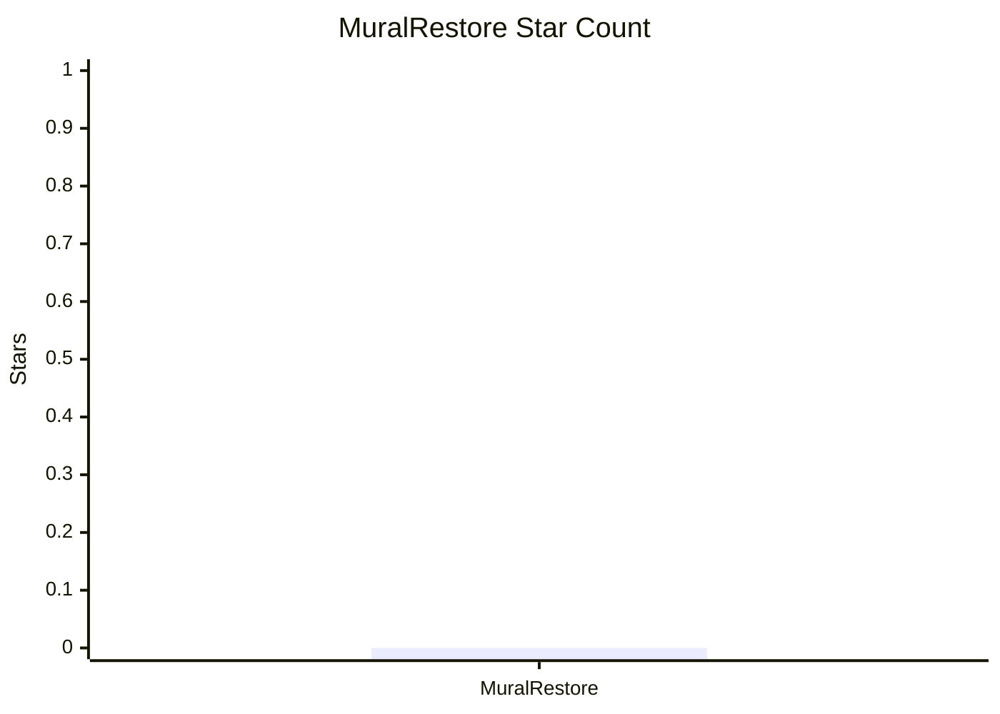

# MuralRestore

## Project Overview

- Project Title: Digital Image Restoration Methods and Implementation for Murals
- Lead Student: Yiyu Li
- Expected Completion Time: On or before May 15, 2026

This project examines digital image restoration methods for murals and their implementation, aiming to improve restoration quality for damaged mural imagery in cultural heritage scenarios.

## Star Statistics

This project is currently maintained as a subdirectory inside the AI4ART repository and does not yet have a standalone GitHub repository. The current standalone project star count is recorded as 0.

